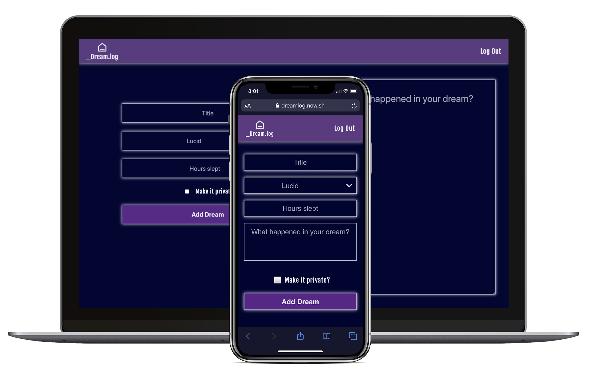
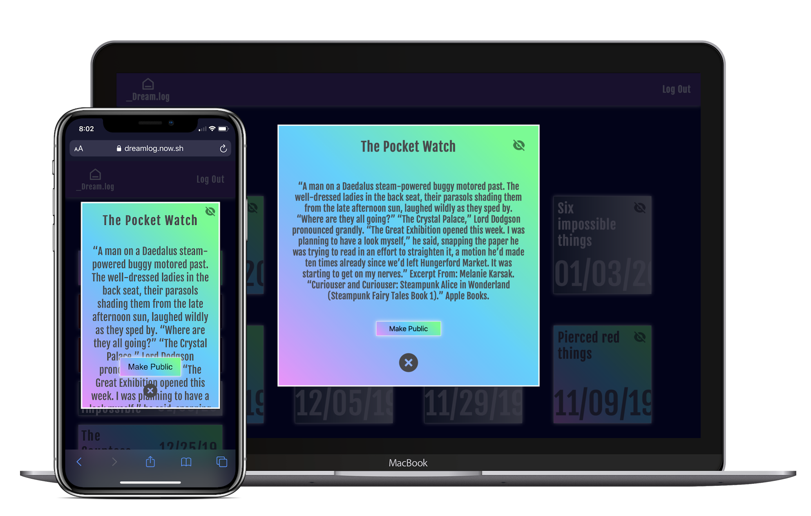

# Dream.log

Dream Log App is a dream journal/blog. It’s compatible with any device.

Dream log can be used by users in two different ways - as a registred user and as a guest. Guest user can only read someone's dream blog while registred user can store his dreams, add dreams to a dream blog, view personal dream statistics etc.

In order to start using **Dream Log** in full, you need to sign up for an account. As soon as you sign up, **Dream Log** will email you a verification link. Click the link and you're all set!
Now you can start using the app. After you login, you will be redirected to the dash board.

To add your first dream click on the "add dream" button. You can only add your last night dream/dreams. There is no way to add dreams from the past because all added dreams will be dated as of today. That's why we encourage you to include dream journaling into your morning rutine.

Add Dream form requeres the folowing info from a dreamer:

- Dream title
- dream type (lucid, normal or nightmare)
- amount of hours dreamer slept last night
- and a short story about the dream.

All added dreams are public by default and will be available in your dream blog. You can share a link to your blog with whoever you'd like.

If you want your dream to be private you can either mark the checkbox "make it private" while adding the dream or you can change the privacy of any dream later on in your "dream log".

We purposly excluded the functionality of delteling dreams. We dont want you to delete any of your dreams. Ever. The main phylosophy behind the dream log app is to keep a track of your dreams.

In statistics section you can get a lot of information about your dreams.

You can learn how many dreams you had so far, how many dreams you had per each dream type, how many hours you sleep, how many hours you sleep on average or how many hours you sleep on average per dream type etc.

If you ever want to change your email or password you can do so by clicking "edit page" button from the "dash board" page. You also can reset your password from the login page if you ever happen to forget it.

In order to delete your page and all data press "delete button" on the "dash board" page.

Excited to start using the dream log? Check out the [live page](https://dreamlog.now.sh/).

You can use the foolowing demo user credentials:

- email: test@test.com
- password: testtest
