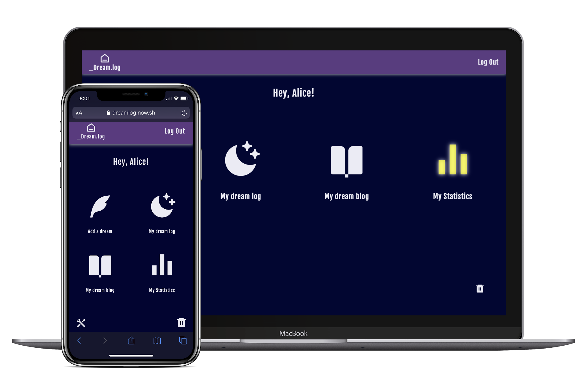
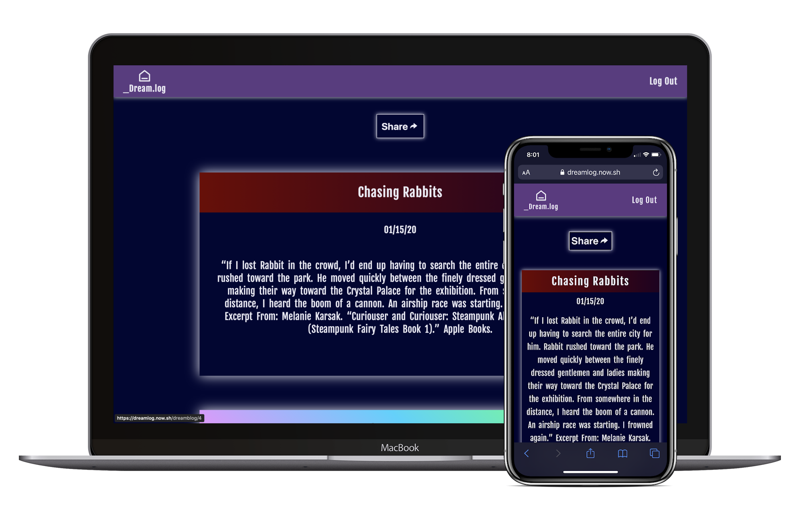
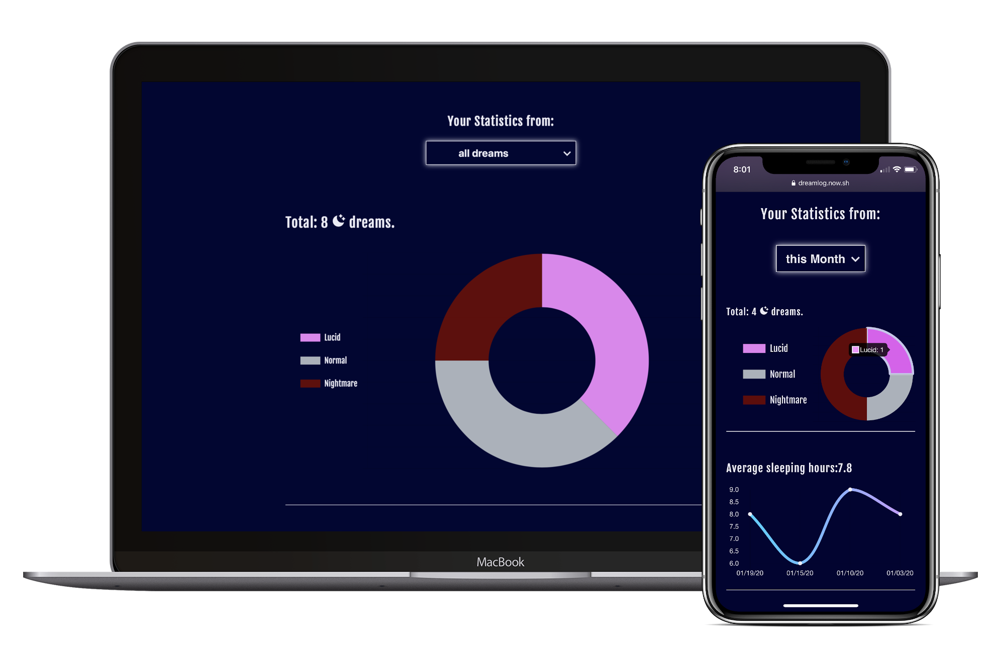

# Dream.log

Dream Log App is a dream journal/blog. It’s compatible with any device.

You can access Dream Log as a registered user or as a guest. Guests can read others’ dream blogs while registered users can store dreams, add dreams to a dream blog, and view their personal dream statistics.

In order to start using **Dream Log** in full, you need to sign up for an account. As soon as you sign up, **Dream Log** will email you a verification link. Click the link and you're all set!

Now you can start using the app. After you login, you will be redirected to the dashboard.

To add your first dream click on the "add dream" button. You can only add last night’s dream(s). There is no way to add dreams from nights prior to last night because all new dreams added will be dated as today. That's why we encourage users to include dream journaling into their morning routine.

To add a dream Dream Log requires the following info:

- Dream title
- Dream type: lucid, normal or nightmare
- Amount of hours slept
- A summary of the dream

All added dreams are public by default and will be available in your dream blog. You can share a link to your blog with whomever you like.

If you want a dream to be privatized, mark the checkbox “make it private” before adding the dream to your blog or change the privacy settings of a dream in your Dream Log.

The main purpose of Dream Log is to keep  track of your dreams. Therefore, the option to delete a dream or edit it after it has been stored has been excluded.

In the statistics section, users can track how many dreams they’ve had, how many dreams per dream type, how many hours of sleep they get a night, the average for hours of sleep per night, and the average for hours per dream type.

To change your email or password you can do so by clicking the “edit page" button from the dashboard. You can also reset your password from the login page if you forget your password.

In order to delete your Dream Log and all your data saved to the app press the "delete button" on the dashboard.

Techonologies I used to build this: React (Router, Context, Hooks), CSS, HTML.

Excited to start using the dream log? Check out the [live page](https://dreamlog.now.sh/).

The following are credentials for demoing the app:

- email: test@test.com
- password: testtest
